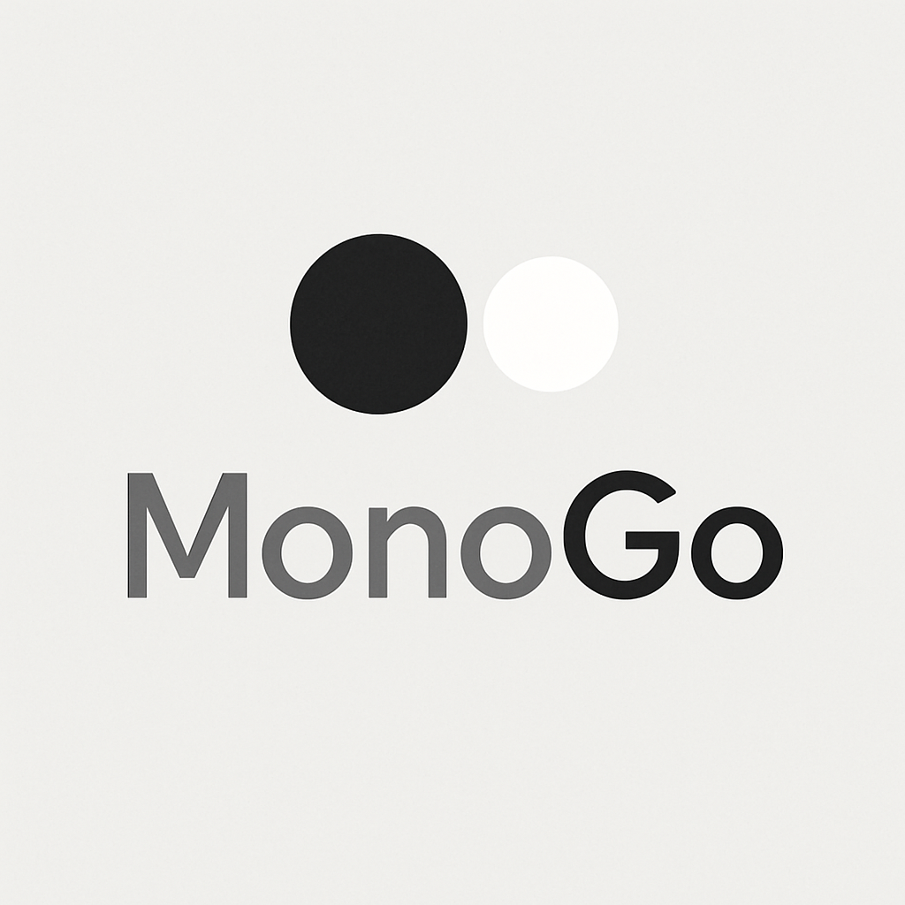

# MonoGo 바둑 연습 웹앱 기획서 – 2단계 (디자인 작업)
작성일: 2025-08-04

---

## 🎨 2단계 – 디자인 작업

### 🔹 [2-1] 로고 스타일 가이드

브랜드명: MonoGo
로고 느낌:
   * 조용하고 집중된 분위기 (개인 연습용)
   * 바둑돌(흑/백) + 말풍선 or 사유의 이미지
   * 미니멀한 흑백 테마 or 따뜻한 무채색 계열
   *    

추천 스타일:
| 요소     | 설명                                                  |
| ------ | --------------------------------------------------- |
| **폰트** | 산세리프(예: Inter, Noto Sans, Pretendard) – 조용하고 깔끔한 인상 |
| **컬러** | `#1a1a1a` (흑돌), `#f2f2f2` (백돌), `#888888` (중성 회색)   |
| **형태** | 로고 왼쪽에 원형 돌 2개 (흑/백), 오른쪽에 텍스트 `MonoGo`             |

---

### 🔹 [2-2] 색상 및 폰트 가이드
| 항목     | 값                                                  |
| ------ | -------------------------------------------------- |
| 메인 배경  | `#ffffff` or `#f5f5f5`                             |
| 메인 텍스트 | `#1a1a1a`                                          |
| 강조 색상  | `#007acc` (파란 계열), 또는 `#888888` (중립톤)              |
| 기본 폰트  | `Pretendard`, `Noto Sans KR`, `Inter` (웹 폰트 사용 추천) |

---

### 🔹 [2-3] 랜딩 페이지 UI 목업 (기획 구조)
```plaintext
┌───────────────────────────────┐
│          MonoGo 로고           │
│-------------------------------│
│  [자유 연습 시작]              │
│  [기보 따라 두기]              │
│  [수독 모드]                   │
│  [묘수 노트 보기]              │
└───────────────────────────────┘
```

---

### 📅 다음 단계

- [X] 3단계: 기술 스택 및 구조 설계
